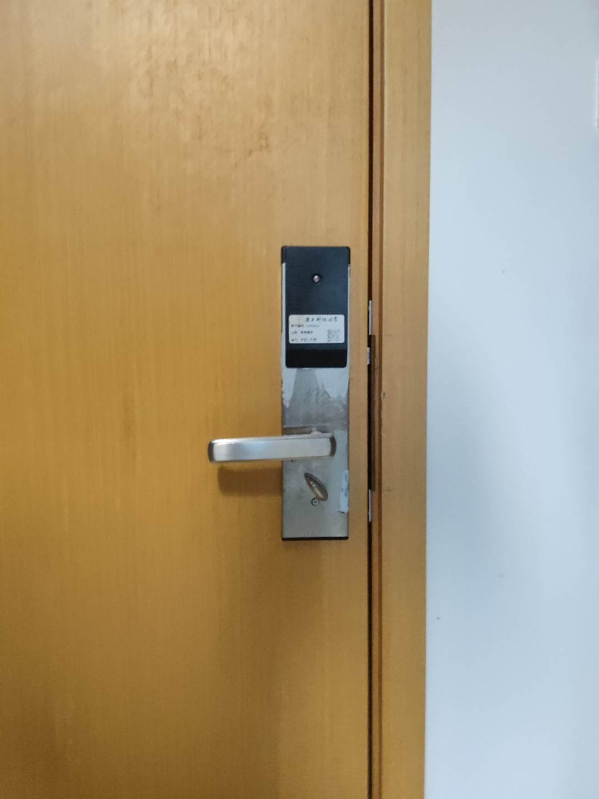

  
  
<h1 align="center">
  南科大宿舍门锁套件
</h1>

  丢掉你的校园卡

人脸识别、模糊密码、电子反锁、访客密码、无痕恢复……</a>

_This page is not available in [English](README.en.md) yet._ 

                                                   

:unlock:这个项目使用两片ESP32开发板以及一系列模块，将宿舍开门体验提到了新高度

:star:欢迎Star

:+1:项目采用CC0协议，欢迎复刻、商用、传播

:poop:假如你想在此基础上开发新功能，看不懂屎山代码或有任何疑惑，欢迎issue

---

# :world_map:Table of Contents
- [功能](#功能)
- [原理](#原理)
- [复刻](#复刻)
  - [:money\_with\_wings:物料清单（全功能-预算敏感版本）](#money_with_wings物料清单全功能-预算敏感版本)
  - [:wrench:所需工具](#wrench所需工具)
  - [门的部分](#门的部分)
  - [门外模块（exModule）](#门外模块exmodule)
  - [门内模块（inModule）](#门内模块inmodule)
- [To Do](#to-do)

# 功能

# 原理
拆开门发现有调试的线，详见[博客](wait-to-be-writed)

# 复刻
本项目在开始之初的设计目标之一就是尽可能低的复刻门槛，所以使用的都是现成的市售模块。虽然牺牲了一些集成度和成本，但是你不需要经历繁复地采购和焊接贴片元件，只需少许简单焊接和组装就能复刻本项目。

如果对某一步的详细程度感到不满意或有任何疑惑，欢迎提交issue。

## :money_with_wings:物料清单（全功能-预算敏感版本）
> 第一步，下面全部买回来

| n       | 名称                      | 数量 | 款式                                             | 总价         | 链接                                                                                                                                         | 备注                                                                                                                                                             |
| ------- | ------------------------- | ---- | ------------------------------------------------ | ------------ | -------------------------------------------------------------------------------------------------------------------------------------------- | ---------------------------------------------------------------------------------------------------------------------------------------------------------------- |
| 0       | luat esp32-s3开发板       | 1片  | ESP32S3开发板                                    | ￥29.9        | [淘宝合宙旗舰店](https://item.taobao.com/item.htm?spm=a1z09.2.0.0.67002e8dnQlfYj&id=696836421009&_u=53t2jj8gb611)                            | 可以换其他家，但是记得修改pcb封装尺寸和代码引脚定义                                                                                                              |
| 1       | luat esp32-c3开发板       | 1片  | 经典款ESP32C3开发板                              | ￥12.9        | [淘宝合宙旗舰店](https://item.taobao.com/item.htm?spm=a1z09.2.0.0.67002e8dnQlfYj&id=666579064570&_u=53t2jj8g0ed4)                            | 同上                                                                                                                                                             |
| 2       | 人脸识别模块HLK-FR1002    | 1个  | 【LD2420单模块】24G雷达模块（人体移动微动感应）  | ￥72.5        | [淘宝海凌科旗舰店](https://detail.tmall.com/item.htm?_u=53t2jj8g16d6&id=693925937468&skuId=4929017661289&spm=a1z09.2.0.0.67002e8dnQlfYj)     |                                                                                                                                                                  |
| 3       | 雷达模块HLK-LD2420        | 1个  | 【强力推荐】测试套件B: FR1002单模块+端子连接线*1 | ￥9.9         | [淘宝海凌科旗舰店](https://detail.tmall.com/item.htm?_u=53t2jj8g7db2&id=703242126067&skuId=4954211957536&spm=a1z09.2.0.0.38472e8dTHnsiW)     |                                                                                                                                                                  |
| 4       | 内模块pcb打板             | 1片  | 略                                               | ￥20          | [Gerber文件](pcbDesign/imModule/inModule_Gerber.zip)                                                                                         | 嘉立创价格，可以换其他家，洞洞板手焊（￥2.5），立创eda抄板白嫖（￥0）                                                                                              |
| 5       | 外模块pcb打板             | 1片  | 略                                               | ￥40左右      | [Gerber文件](pcbDesign/exMoudle/sustech_door_kit-exModule-Gerber.zip)                                                                        | 同上，但是需要两片，一片用作焊接，一篇用作背板安装                                                                                                               |
| 6       | 继电器                    | 1个  | 4路5v红板                                        | ￥12          | [淘宝优信电子](https://item.taobao.com/item.htm?spm=a1z09.2.0.0.67002e8dnQlfYj&id=549692985984&_u=53t2jj8gef8e)                              | 要买5v的，不然不能开发板直接触发                                                                                                                                 |
| 7       | :keyboard:轴体            | 14个 | cherryMX的封装就能够焊上，具体轴体按需选择       | ￥10          | [淘宝不知名店铺](https://item.taobao.com/item.htm?spm=a1z09.2.0.0.67002e8dnQlfYj&id=626986550029&_u=53t2jj8g20a3)                            |                                                                                                                                                                  |
| 8       | :keyboard:键帽            | 12个 | 标准的十字孔能插上轴体就行                       | ￥6.3         | [桃堡~或者去网吧悄悄扣走windows键~](https://item.taobao.com/item.htm?spm=a21n57.1.0.0.33f6523cuvqG1C&id=704738471960&ns=1&abbucket=0#detail) | 有实力可以加钱上点好的                                                                                                                                           |
| 9       | :nut_and_bolt:M3x25螺丝   | 5个  | 直径3mm，长度25mm，0.5螺距                       | ￥0.3         | [1688](https://detail.1688.com/offer/572533111204.html?spm=a2615.2177701.autotrace-smt_offerGeneral.6.20a22b78zPF4M8)                        | 其实3个就够了，剩下2个惩罚不仔细看备注的强迫症                                                                                                                   |
| 10      | :nut_and_bolt:M3x？？螺丝 | 4个  | 长度？？mm，其余同上                             | ￥5.2         | [1688](https://detail.1688.com/offer/572533111204.html?spm=a2615.2177701.autotrace-smt_offerGeneral.6.20a22b78zPF4M8)                        | 算上邮费                                                                                                                                                         |
| 11      | :nut_and_bolt:M3螺母      | 4个  | 直径M3，六角对边长5.5mm，螺距0.5mm，2.4mm厚      | ￥0.2         | [1688](https://detail.1688.com/offer/572533111204.html?spm=a2615.2177701.autotrace-smt_offerGeneral.6.20a22b78zPF4M8)                        | 邮费算在上面了                                                                                                                                                   |
| 12      | :nut_and_bolt:M3防松螺母  | 3个  | 长度？？mm，其余同上                             | ￥0.2         | [1688](https://detail.1688.com/offer/572533111204.html?spm=a2615.2177701.autotrace-smt_offerGeneral.6.20a22b78zPF4M8)                        | 用来分隔继电器和内模块，邮费算在上面了                                                                                                                           |
| 13      | :electric_plug:硅胶线     | 4条  | 统一1m，18AWG；红色、黑色、黄色、白色            | ￥6           | [桃堡](https://item.taobao.com/item.htm?spm=a1z09.2.0.0.67002e8dnQlfYj&id=654286714565&_u=53t2jj8g48c8)                                      |                                                                                                                                                                  |
| 14      | :electric_plug:CtoC数据线 | 1条  | 1m左右就好                                       | ￥6           | [桃堡](https://detail.tmall.com/item.htm?abbucket=0&id=662435210626&ns=1&spm=a21n57.1.0.0.42b9523caGo622&skuId=4772418768729)                | 如果你经常有连接开发板的需求，推荐合宙的[10条各种版本打包](https://item.taobao.com/item.htm?spm=a1z10.5-c-s.w4002-24045920841.24.230e5aa3n5OKyx&id=706207670841) |
| 15      | DC-DC模块                 | 1个  | 链接里就一个，买他就好                           | ￥5.7         | [桃堡](https://item.taobao.com/item.htm?spm=a1z09.2.0.0.35b32e8dcWQ58H&id=536347025767&_u=53t2jj8g6082)                                      |                                                                                                                                                                  |
| **666** | **总计**                  |      |                                                  | **￥240左右** |

### :moneybag:物料清单（删减功能-预算敏感版本）
如果这超过了你的预算，可以通过删减功能来减少部件，比如可以删减掉人脸识别功能，避免购买HLK-FR1002和HLK-LD2420将价格减到**153元**。

或者可以eda抄板，节省打板价格。**注意，外模块尺寸为5*13cm，不在立创优惠劵的尺寸范围内，可以试着删减掉人脸识别后将尺寸缩小。**

花上几个小时抄板，砍掉一些功能理论最低预算为**86元**。

## :wrench:所需工具
> 如果只是为了复刻项目，下面这些工具不用全部买回来，想办法借到比较合理。但这是个社恐友好的项目，所以放上一些参考购买链接。

| 名称         | 用途       | 参考购买链接                                                                                                                                                                   |
| ------------ | ---------- | ------------------------------------------------------------------------------------------------------------------------------------------------------------------------------ |
| 剥线钳       | 剥线       | [【简装】7寸单色手柄剥线钳](https://detail.tmall.com/item.htm?abbucket=0&id=43540267171&ns=1&spm=a21n57.1.0.0.1f6d523cvhBHgo)                                                  |
| 烙铁         | 焊接       | [标配+C2C数据线+转接板+氮化镓充电器+K65小刀头+BC2尖头 ](https://detail.tmall.com/item.htm?abbucket=0&id=662514528915&ns=1&skuId=4952079646578&spm=a21n57.1.0.0.1f6d523cvhBHgo) |
| 焊锡         | 焊接       | [含锡40%线径0.8mm-50克](https://detail.tmall.com/item.htm?abbucket=0&id=595763429832&ns=1&skuId=4138975609871&spm=a21n57.1.0.0.1f6d523cvhBHgo)                                 |
| 十字螺丝刀   | 打螺丝     | [5*75十字【专业款】](https://item.taobao.com/item.htm?spm=a21n57.1.0.0.33f6523cuvqG1C&id=709830788462&ns=1&abbucket=0#detail)                                                  |
| 扳手         | 打螺母     | [【中小型】活扳手/管钳双功能两用8寸-200mm](https://detail.tmall.com/item.htm?abbucket=0&id=655191633412&ns=1&spm=a21n57.1.0.0.33f6523cuvqG1C&skuId=4992109567932)              |
| 胶布         | 防止短接   | 是个胶布就行                                                                                                                                                                   |
| 美工刀或笔刀 | 剥线       | 最好锋利一点                                                                                                                                                                   |
| 热熔胶枪     | 加固剥线处 | [50W豪华小胶枪+ 10胶棒](https://detail.tmall.com/item.htm?abbucket=0&id=559404680156&ns=1&skuId=4912590361684&spm=a21n57.1.0.0.7fe2523cHBphMQ)                                 |

## 门的部分
### 1.拆门

> 首先，这部分不适合一个人，建议你找一个室友帮忙

> **门只能从内部拆开，平时能够看到2颗裸露的螺丝，大胆地拆。**

> **拆开后把塑料外壳取下，能看到三颗螺丝,前面两颗，后面一颗。拆掉前面两颗整个把手就会掉下来。**

> 这时你应该可以看到内门把手小锁的销被取走了，这就是我们不能从里面反锁的原因。网上没找到合适的，你有时间可以自己建模3D打印一个就能重新获得机械反锁门的能力。

> 因为这部分是后写的，有一些照片因为安装了内模块不能继续拍，sorry

> **内门把手掉下来后，会露出一个框架，有两颗螺丝，这两颗螺丝固定内框架和外门把手**

> 下图是一个，还有一个在更下方

> **一手扶着外门把手，一手拆内框架的螺丝**

> **螺丝拆下来后，内框架会掉下来，外门把手也会掉下来**

> **你应该可以看到掉下来的外门把手框里有一些线连到门里面（忽略图片左方的凝固的热熔胶）**

> **这些线有不同的功能，红线12v供电、黑线地，其他四个颜色短接地会有不同的效果，效果如下表**

| 短接 | 效果                 |
| ---- | -------------------- |
| 黑橙 | 面板变绿，正常开门   |
| 黑绿 | 锁门（面板保持蓝色） |
| 黑黄 | 开门                 |
| 黑白 | 锁门（面板变红）     |

> **你已经看到线了，进入下一步，剥线！**

### 2.剥线

> **这是一个手艺活，比较考验耐心**

> **你需要用美工刀或者笔刀将线的外层剥开，露出里面的金属。注意不要直接切断，特别是红色和黑色的电源线，没人知道这个系统断电重启之后还能不能正常工作（如果你切断了可以在readme里更新一下结果）**

> **项目只会用到4根线，分别是红色、黑色、黄色、白色。所以你只需要剥4根线**

### 3.焊接延长线

> 这一步可能会比较难

> **线剥好后，剪下你买的[硅胶线](https://item.taobao.com/item.htm?spm=a1z09.2.0.0.67002e8dnQlfYj&id=654286714565&_u=53t2jj8g48c8)，长度需要自己估计一下，大概40cm（估计值，绝对不准）。用[剪线钳](https://detail.tmall.com/item.htm?abbucket=0&id=43540267171&ns=1&spm=a21n57.1.0.0.1f6d523cvhBHgo)剥去两头的线。一端镀锡，一端缠胶布备用**

> **然后给外门把手剥线的地方也镀上锡**

> **然后把对应颜色的线焊上**

> **打上热熔胶防止短接同时加强连接处**

> **最后效果如下（方便研究我把所有都剥了）**

### 4.走线
> **把线首先穿过外门把手上面的小框**

> **然后穿过门上的洞，这样外门把手就不会因为线的存在而不能贴合门体**

> **最后效果如下，平整度没有差别**

### 5.装门

> **然后就是逆向装回去的过程，不多说了**

> **唯一值得注意的点是，可以用一段胶布缠上整束线，然后用一个扎带固定，这样就把拉力转移到扎带部分而不是焊点** 

> **最后效果如下**

> 至此拆门部分结束

## 门外模块（exModule）
### 1.焊接
### 2.开发板刷入程序
#### a.更改参数
### 3.配置模块
#### a.人脸注册
#### b.修改雷达门限
### 4.调试
### 5.组装
## 门内模块（inModule）
### 1.焊接
### 2.开发板刷入程序
#### a.更改参数
### 3.调试
### 4.安装
#### a.接线
# To Do
对功能有任何想法和提议，都欢迎提交issue。当然，保证不保证解决。
- [ ] 完善文档
- [ ] 接入homeassistant，让小爱同学开门
- [ ] 通信协议
- [ ] 剩下的两根线
- [ ] 更多的功能
- [ ] 更低的复刻门槛
